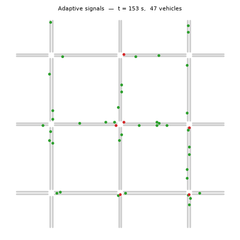
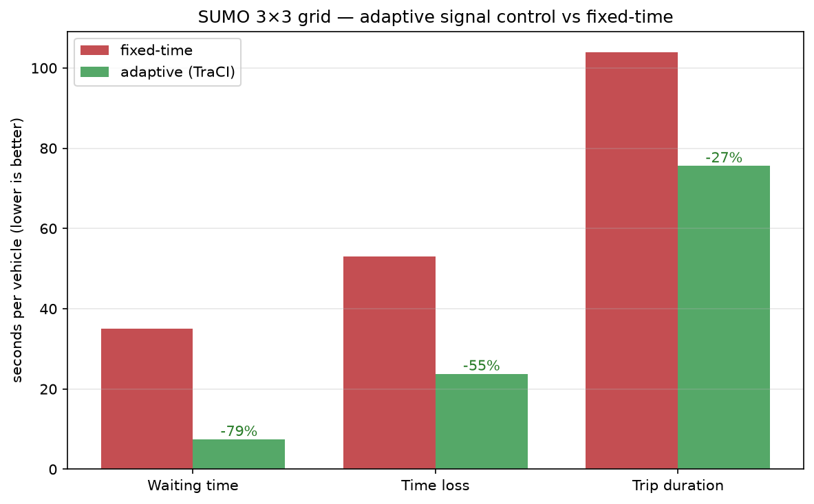

# v2 — Closing the Loop: Adaptive Traffic-Signal Control in SUMO

The parent project *forecasts* traffic. This extension is the other half of a smart-city system:
**acting on traffic.** In the [SUMO](https://www.eclipse.dev/sumo/) microscopic simulator, I run a
small grid of intersections under two signal-control strategies on **identical traffic** and measure
the difference:

- **Fixed-time** — SUMO's built-in static 90-second cycle (the baseline).
- **Adaptive** — a TraCI controller that watches the live queue at each intersection and gives green
  to the busiest approach (longest-queue-first), with min/max green guard-rails.



*Adaptive signal control running on the 3×3 grid — green = moving, red = stopped.*

## Result

Same network, same 2,400 vehicles, same seed — only the controller differs:

| metric (per vehicle) | fixed-time | adaptive | improvement |
|---|--:|--:|--:|
| **avg waiting time** | 35.0 s | 7.4 s | **−78.8%** |
| avg time loss (vs free-flow) | 53.0 s | 23.8 s | −55.1% |
| avg trip duration | 104.0 s | 75.6 s | −27.3% |



**Honest caveats:** a toy 3×3 grid *exaggerates* the gain — real-world adaptive control yields more
modest improvements — but the comparison is fair (identical demand, vehicle counts match exactly) and
the mechanism is real: a fixed cycle wastes green on empty approaches while cross-traffic waits; the
adaptive controller doesn't.

## How it connects to the GNN

The traffic GNN is the **perception** layer (predict congestion); this is the **control** layer (act
on it). They're deliberately separate domains — METR-LA is *freeway* data with no signals, SUMO is
*urban intersections* — so this reuses the **idea**, not the trained weights. In this demo the
controller reacts to the *current* queue; the natural next step is to feed it a *short-horizon
forecast* of incoming traffic, which is exactly the role the A3T-GCN forecaster plays. That's the
"predict → act" loop.

## How to run

```bash
pip install eclipse-sumo traci sumolib      # bundles the SUMO binaries; no system install needed
python build_net.py        # 1. generate the 3x3 grid (static-TLS baseline)
python build_routes.py     # 2. generate one seeded route file (shared by both runs)
python run_static.py       # 3. baseline: fixed-time signals
python run_adaptive.py     # 4. adaptive: TraCI longest-queue-first controller
python compare.py          # 5. print the comparison table
python plot_results.py     # 6. (optional) write result.png
```

Runs fully headless on CPU (no GPU needed) in a couple of minutes.

### Watch it live 👀

To actually *see* the cars and the traffic lights, add `--gui` (opens SUMO's GUI window):

```bash
python run_adaptive.py --gui   # watch the adaptive controller manage the lights
python run_static.py  --gui    # watch the dumb fixed-time baseline, for comparison
```

The window auto-plays at ~150 ms/step. Use the GUI's speed slider to fast-forward, click a junction
to inspect its phases, or just watch the queues build and clear. Close the window when you're done.

## Files

| file | role |
|---|---|
| `build_net.py` | netgenerate → `grid.net.xml` (3×3 grid, static traffic lights) |
| `build_routes.py` | randomTrips.py → `grid.rou.xml` (seeded demand, reused by both) |
| `run_static.py` | baseline run (fixed-time, no control code) |
| `run_adaptive.py` | the TraCI adaptive controller (the closed loop) |
| `compare.py` | parse tripinfo, print the delay comparison |
| `plot_results.py` | bar chart → `result.png` |

## What's next

- **Drive the controller with the GNN forecast** instead of the live queue — the real "predict→act."
- A bigger / real-world network (import OSM) and a stronger policy (max-pressure).
- A learned RL controller as a third arm of the comparison.
